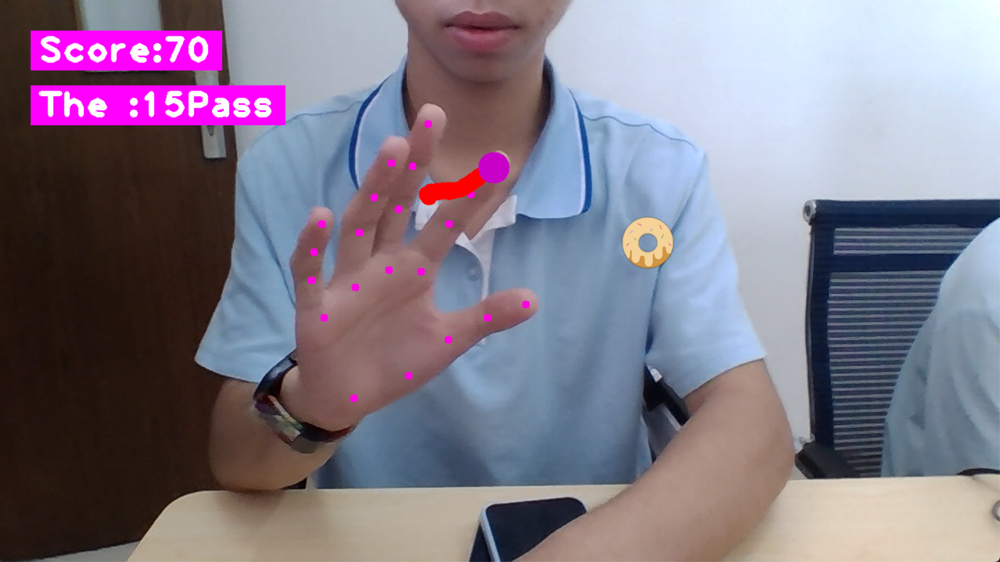
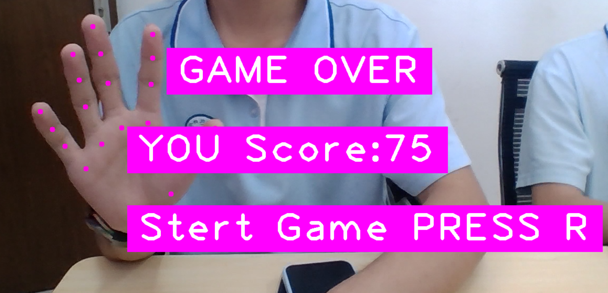
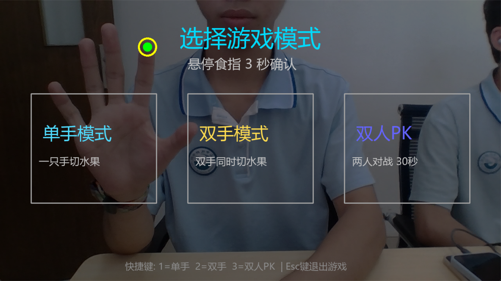
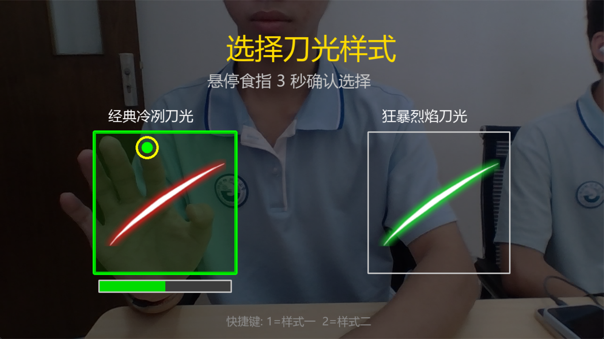

# 经典数字游戏的体感重构：从“贪吃蛇”到“AI切水果”

本项目是一套基于 MediaPipe 和 OpenCV 的纯视觉体感交互系统。旨在打破传统游戏必须依赖鼠标、键盘或触屏的“屏幕禁锢”，用 AI 技术赋予经典游戏倡导健康、释放情绪的新属性。

项目分为两个演进阶段：**初代《AI体感贪吃蛇》** 与 **完全进化版《AI切水果》**。

---

## 🐍 阶段一：初代《AI体感贪吃蛇》 (Version 1.0)

回溯功能机时代，《贪吃蛇》是无数人的数字启蒙，但玩家只能僵硬地按压物理按键；到了智能手机时代，玩家依然被死死禁锢在几英寸的屏幕前。为了解决“低头族”的痛点，我们开发了初代作品：

通过电脑摄像头，玩家可以直接在空中挥动食指，引导屏幕中的蛇去吃甜甜圈。


- **玩法说明**：系统会实时捕捉你的指尖坐标，蛇头会紧紧跟随你的手指移动。吃到甜甜圈后蛇身变长、得分增加。
- **闯关与结算**：游戏包含关卡机制，过关或失败后会进入结算画面。按 `r` 键可以重新开始，按 `q` 键退出。


**初代的局限与思考**：
在实际测试中我们发现，贪吃蛇的“方向引导”动作相对舒缓，仍不足以达到充分舒展上肢、释放情绪的锻炼效果。这启发我们挑战一个需要“高速挥砍”的交互场景——《切水果》。

---

## 🍉 阶段二：完全进化版《AI切水果》 (Version 2.0)

在初代贪吃蛇的视觉框架基础上，我们针对**高速动作捕捉、多线程渲染、复杂物理碰撞（防穿模）以及多手追踪防串线**进行了彻头彻尾的底层算法重构，最终诞生了这款支持双人同屏 PK 的《Swift-Fruit-Slice AI 切水果》。

### 1. 首页模式选择
运行游戏后，首先进入模式选择界面：


- **视觉交互**：举起一只手，将食指悬停在想要的模式方块上，绿色进度条走满（约 3 秒）即可确认。
- **键盘快捷键**（备用）：
  - 按 `1`：选择 **单手模式**（一只手切水果）
  - 按 `2`：选择 **双手模式**（两只手同时切水果）
  - 按 `3`：选择 **双人 PK**（两人同屏对战，限时 30 秒）
  - 按 `Esc`：直接退出游戏

### 2. 选择刀光皮肤

- 同样支持食指悬停选择，或者使用键盘 `1`（经典冷冽刀光）、`2`（狂暴烈焰刀光）。按 `q` 可快速跳过。

### 3. 核心切水果玩法
挥动你的手臂，享受高速挥砍的快感！系统内置了点线碰撞数学模型，无论你挥得多快，都不会出现“刀光穿模”的判定失误。
- **连击系统**：连续切中水果不漏掉会增加连击数，触发全屏炫酷特效。
- **躲避炸弹**：
  - 💣 **黑色炸弹 (普通炸弹)**：切到会扣除 3 分。
    <br>
  - ☠️ **红色炸弹 (致命炸弹)**：切到会直接 Game Over，结束当前对局！
    <br>

### 4. 结算界面与重新开始
当一局游戏结束后，系统会自动计算得分或判定双人 PK 的胜负。

- **防误触延迟**：为了防止挥砍动作误触按钮，游戏结束时会有 **2 秒的防误触延迟**，随后交互方块才会浮现。
- **重新开始**：悬停食指在“重新开始”或“主菜单”方块上确认。也支持按 `r`（重开）或 `m`（主菜单）。

---

## 🛠️ 目录结构与运行指南

### 核心目录
- `Snakegame/`: 初代《AI体感贪吃蛇》源码与资源目录。
- `main.py`: 进化版《AI切水果》主程序入口。
- `config.py` & `settings.yaml`: 切水果游戏的热插拔配置与资源加载模块。
- `game_core.py`: 切水果核心逻辑与实体定义 (水果、炸弹、点线碰撞引擎)。
- `ui_screens.py`: 纯视觉控制的悬停 UI 界面组件。
- `assets/` & `models/`: 游戏图像、音效素材及 MediaPipe AI 模型目录。

### 环境要求与安装
确保已安装 Python 3.9+。
使用以下命令安装依赖：
```bash
pip install -r requirements.txt
```

### 运行游戏
**运行 进化版《AI切水果》：**
```bash
python main.py
```
**运行 初代《AI体感贪吃蛇》：**
```bash
cd Snakegame
python main.py
```